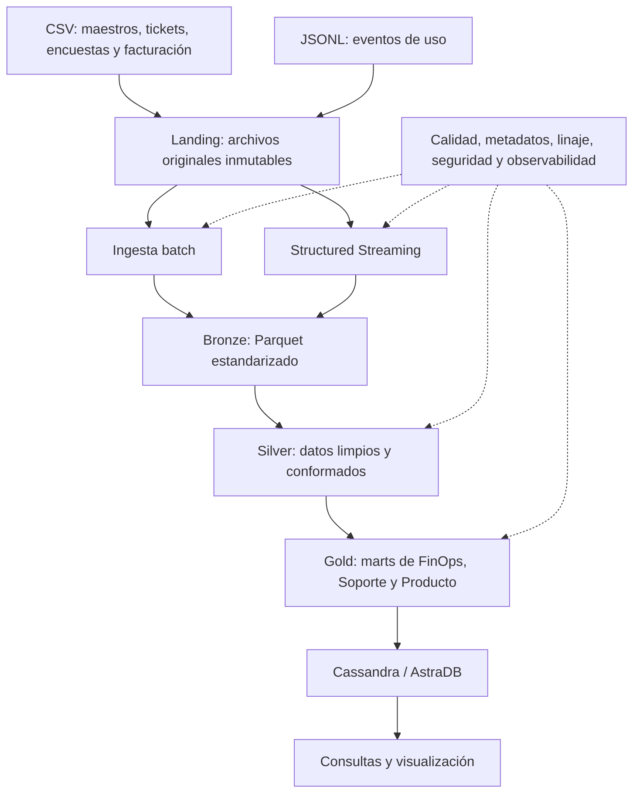
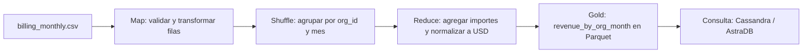

# Cloud Provider Analytics

# 1. Interpretacion del problema

## Problema

El proveedor de servicios cloud recibe información operativa y comercial desde
fuentes batch y eventos de uso. Estos datos tienen nulos, tipos inconsistentes,
valores atípicos y cambios de esquema. Se necesita diseñar una solución que los
organice y prepare para analizar costos, facturación, soporte y uso de servicios.

## Objetivo principal
Diseñar una solución de datos para analizar costos, consumo y soporte
de un proveedor de servicios cloud.
El objetivo del proyecto es proponer un flujo que ingiera esas fuentes, preserve
los datos originales, permita su procesamiento batch y streaming y prepare
información analítica para los equipos de FinOps, Soporte y Producto.

## Usuarios y preguntas de negocio
Para el diseño nos basaremos en las consultas del punto 7.4 como requisitos objetivo.

| Usuario | Preguntas que necesita responder |
|---|---|
| FinOps | ¿Cuáles son los costos y requests diarios por organización y servicio? ¿Qué servicios acumularon más costo en los últimos 14 días? ¿Cuál fue el revenue mensual por organización, considerando créditos, impuestos y moneda? |
| Soporte | ¿Cuántos tickets críticos hubo por organización y día? ¿Qué proporción incumplió el SLA? ¿Cómo varió la satisfacción de los clientes? |
| Producto / Usage | ¿Qué servicios y organizaciones concentran el uso? Cuando estén disponibles, ¿cuántos tokens GenAI y cuánto carbono se registran por día? |

## Criterios de éxito del diseño

La solución propuesta debe permitir responder las cinco consultas analíticas
previstas en la consigna: costos y requests diarios; principales servicios por
costo en 14 días; tickets críticos e incumplimientos de SLA en 30 días; revenue
mensual normalizado a USD; y tokens GenAI con costo estimado cuando existan.

# 2. Justificación de Big Data: las 5V

| Dimensión | Evidencia en el caso | Implicación para el diseño |
|---|---|---|
| Volumen | La muestra incluye 4.112 filas CSV y 43.200 eventos JSONL. Ese volumen sirve para probar el diseño, pero no demuestra por sí solo una necesidad de Big Data. En producción, el supuesto es que los eventos crecerían con la cantidad de organizaciones, recursos y tiempo de retención. | Diseñar el almacenamiento y procesamiento para que puedan escalar. Validar el volumen real con métricas de producción antes de dimensionar recursos. |
| Velocidad | Los eventos de uso tienen timestamps y están fragmentados en archivos para simular micro-lotes. En cambio, maestros, encuestas y facturación se reciben como archivos batch. | Separar el flujo de eventos del batch y contemplar procesamiento incremental de eventos. |
| Variedad | Hay CSV estructurados de organizaciones, usuarios, recursos, tickets, encuestas, marketing y facturación, además de eventos JSONL. El esquema de eventos evoluciona y agrega carbon_kg y genai_tokens en la versión 2. | Definir esquemas por fuente y una estrategia para compatibilizar versiones antes de conformar los datos. |
| Veracidad | Se observan nulos, tipos inconsistentes y valores que requieren validación. En los eventos, value aparece como número o texto; 877 registros no tienen value y 2.075 no tienen unit. También hay costos altos marcados para revisión en analytics. | Incorporar reglas de calidad, trazabilidad y revisión de registros sospechosos, conservando los originales en Landing. |
| Valor | Las áreas de FinOps, Soporte y Producto necesitan analizar costos, facturación, SLA, satisfacción y uso de servicios, incluidos tokens GenAI y carbono cuando estén disponibles. | Preparar datos analíticos orientados a esas preguntas y a los usuarios que los consultan. |

# 3. Inventario y perfil inicial de fuentes

A continuación se resume la exploración inicial de las fuentes.
La tabla de la consigna describe qué contiene cada archivo; aquí se
agregan los resultados observados al revisar los datos.

| Fuente | Filas | Grano probable / clave | Período observado | Hallazgos de calidad |
|---|---:|---|---|---|
| `customers_orgs.csv` | 80 | Una organización / `org_id` | `signup_date`: 04/05–02/07/2025 | 11 `nps_score` nulos. El rango del puntaje requiere aclarar si es una respuesta individual o un índice agregado. |
| `users.csv` | 800 | Un usuario / `user_id` | `created_at`: 04/05–11/08/2025 | 139 `last_login` nulos. |
| `resources.csv` | 400 | Un recurso / `resource_id` | `created_at`: 04/05–21/08/2025 | 83 `tags_json` nulos. |
| `support_tickets.csv` | 1.000 | Un ticket / `ticket_id` | Creación: 09/05–31/08/2025 | 240 `resolved_at` y 254 `csat` nulos. `csat` va de 0 a 7; hay que validar su escala. |
| `marketing_touches.csv` | 1.500 | Una interacción / `touch_id` | 04/05–31/08/2025 | No se encontraron nulos ni duplicados completos. |
| `nps_surveys.csv` | 92 | Una encuesta por organización y fecha | 24/05–31/08/2025 | 19 `nps_score` y 10 comentarios nulos. Los valores de NPS requieren confirmar su significado. |
| `billing_monthly.csv` | 240 | Una factura por organización y mes / `invoice_id` | Junio–agosto de 2025 | 137 `credits` nulos y 13 `subtotal` negativos. Conviene validar el significado de los negativos. |
| `usage_events_stream/*.jsonl` | 43.200 | Un evento; `event_id` es candidato a identificador | Incluye `timestamp`; desde 2025-07-03 a 2025-08-31 (corte en 2025-07-17 por cambio de version) | `value` llega como decimal o texto, aunque los textos pudieron convertirse a número; faltan 877 valores `value` y 2.075 `unit`. Encontramos spikes en la mayoria de los services. |

# 4/5. Diagrama + Patrón arquitectónico elegido

Se propone un patrón híbrido. Los archivos CSV de organizaciones, usuarios,
recursos, tickets, marketing, encuestas y facturación se procesan por batch.
Los eventos de uso JSONL se procesan mediante Structured Streaming para
incorporar incrementos a medida que llegan.

Se elige este patrón porque las fuentes tienen ritmos de llegada distintos:
los datos maestros y de facturación pueden procesarse periódicamente, mientras
que los eventos requieren un análisis más frecuente. Ambos flujos convergen en
el Data Lake y se conforman para preparar información de consumo analítico.

## Arquitectura de alto nivel

# 6. Matriz de requisitos y componentes

| Necesidad de análisis | Fuente | Procesamiento | Resultado esperado |
|---|---|---|---|
| Analizar costo y consumo diario por organización y servicio | Utilizaremos los eventos JSONL, ya que estos conservan los atributos que se piden analizar, ya ademas nos da la pauta de que se necesita que sea de frecuencia diaria. | Spark Structured Streaming; limpieza y agregación por fecha, organización y servicio | Datos agregados en Gold, disponibles para consulta |
| Identificar las organizaciones con mayor costo en los últimos 14 días | Eventos JSONL, campo `cost_usd_increment` | Agregación por organización y ventana temporal; ordenamiento de mayor a menor costo | Ranking Top-N en Gold |
| Medir tickets críticos y tiempos de resolución de los últimos 30 días | Atributos que se encuentran en `support_tickets.csv` | Proceso batch con PySpark; cálculo de cantidad de tickets y tiempos entre creación y resolución, uso del campo severity para identificar los criticos | Indicadores de soporte en Gold |
| Calcular ingresos mensuales en USD | `billing_monthly.csv` | Proceso batch; tratamiento de créditos, impuestos y conversión usando el tipo de cambio disponible | Resumen mensual por organización y moneda normalizada |
| Analizar tokens y costos de GenAI cuando estén informados | Eventos JSONL, campos `genai_tokens` y `cost_usd_increment` | Procesamiento de eventos de la versión de esquema que incluya esos campos; exclusión o identificación de valores ausentes | Consumo de tokens y costo por organización, servicio y período |

Los datos originales se conservan en la zona **Raw/Bronze**. Luego se validan y normalizan en **Silver**, y las métricas listas para responder estas preguntas se guardan en **Gold**.

# 7. Diseño del Data Lake

| Zona | Contenido y formato | Reglas principales | Retención propuesta |
|---|---|---|---|
| Landing / Raw | Archivos originales: CSV y JSONL | Conservarlos sin modificar y registrar fecha de carga y archivo de origen | 12 meses para batch, 6 meses para jsonl; pasar a almacenamiento de archivo después de 60 días. Permite auditar y reprocesar los datos originales |
| Bronze | Datos cargados y organizados, manteniendo la información de origen. Seria la zona "STAGING". | Agregar metadatos de ingesta y conservar la versión del esquema | 12 meses. Conserva datos preparados para análisis y reprocesamiento |
| Silver | Datos validados y normalizados en Parquet | Normalizar tipos y fechas; registrar errores y marcar valores sospechosos, sin eliminarlos automáticamente. Hacer controles de registros duplicados para prevenirlos , ejemplo, controles de reproceso de informacion. | 12 meses. |
| Gold | Métricas y conjuntos preparados para responder las preguntas de análisis | Publicar resultados agregados y documentar sus reglas de cálculo | 24 meses. Permite comparar tendencias mensuales entre períodos |

Los plazos son supuestos iniciales para el diseño y deberán validarse con las necesidades del negocio y sus políticas de retención. La consigna no establece una duración obligatoria.

### Organización y particionamiento

Los archivos originales se organizarán por fuente y fecha de carga. Los eventos procesados se particionarán por fecha del evento, por ejemplo, año, mes y día. En Silver y Gold se propone usar Parquet para facilitar el procesamiento analítico.
No se propone particionar inicialmente por `org_id` o `resource_id`, porque podrían generar muchas particiones pequeñas. Los costos negativos, nulos y otros valores sospechosos se identificarán para su revisión, sin descartarlos automáticamente.
Se propone generar procesos de control data quality (procesos DQ) apuntando a la zona Silver, generando reportes de calidad que nos ayuden a prevenir incidencias en los datos.
Estas reglas podrán correr diaria o mensualmente, según a que tipo de atributos apunten.
pd: Se relaciona con el punto de calidad que nos pide el proyecto en la segunda parte.

### Promoción entre zonas

Los datos pasan de Raw a Bronze por camino directo. 
De Bronze a Silver luego de validar su estructura, tipos y fechas. 
En Silver se normalizan los campos y se registran las anomalías. 
Gold se genera a partir de datos suficientemente validados para las métricas definidas.

# 8. Flujos de datos

| Etapa | Batch: archivos CSV | Streaming: eventos JSONL |
|---|---|---|
| Ingesta | PySpark lee los CSV como un proceso por lotes | Spark Structured Streaming detecta los nuevos archivos JSONL y los procesa en micro-lotes |
| Procesamiento | PySpark transforma, valida y agrega los datos | Structured Streaming lee el esquema y procesa los eventos; se prevén deduplicación y manejo de eventos tardíos |
| Data Lake | Parquet para los datos procesados en Bronze, Silver y Gold | Parquet para los datos procesados en Bronze, Silver y Gold |
| Consulta | Cassandra/AstraDB para exponer métricas preparadas | Cassandra/AstraDB para exponer métricas de uso y costo |

## Flujo batch

Los archivos CSV de organizaciones, usuarios, recursos, facturación, tickets, encuestas y marketing se procesan periódicamente mediante PySpark.

1. Los archivos originales se reciben en Landing/Raw y se conservan sin modificar.
2. Se cargan en Bronze con metadatos de ingesta, como fecha de carga y nombre del archivo.
3. En Silver se normalizan tipos y fechas, se aplican controles de calidad y se preparan las relaciones entre entidades cuando las claves lo permiten.
4. En Gold se calculan métricas de facturación mensual y de soporte.
5. Los resultados que deban responder consultas frecuentes se publican en Cassandra/AstraDB.

## Flujo streaming

Los eventos de uso JSONL llegan fragmentados en archivos que simulan micro-lotes. Spark Structured Streaming procesa los archivos nuevos a medida que aparecen.

1. Los archivos originales se reciben en Landing/Raw.
2. Structured Streaming lee los eventos con un esquema definido y registra la versión del esquema.
3. Los eventos procesados se escriben en Bronze como Parquet.
4. En Silver se normalizan los datos, se deduplican por `event_id`, se controlan los eventos tardíos y se separan en quarantine los registros que no superen las reglas definidas.
5. En Gold se agregan métricas de uso, requests y costos por organización, servicio y día. Los tokens GenAI se calculan cuando el esquema y los datos los incluyen.
6. Las métricas necesarias para las consultas se publican en Cassandra/AstraDB.

### Capacidades transversales

Se registran metadatos de origen y procesamiento. Para el flujo streaming se propone usar checkpointing para recuperar el avance ante una interrupción. Los errores y registros en quarantine deben quedar identificados para su revisión y reproceso.

# 9. Procesamiento batch de referencia: lógica MapReduce

Ejemplo: preparar el mart mensual de revenue por organización a partir de `billing_monthly.csv`.

- **Map:** leer cada registro y validar los campos necesarios. Transformarlo en una clave `(org_id, mes)` y en valores con los importes de subtotal, créditos e impuestos, junto con la moneda y el tipo de cambio disponible.
- **Shuffle / agrupamiento:** reunir los registros que tengan la misma organización y mes.
- **Reduce:** sumar los importes de cada grupo y normalizar a USD según la regla de negocio definida para créditos, impuestos y tipo de cambio.
- **Salida:** guardar el resultado agregado en Gold, como `revenue_by_org_month`, y prepararlo para su consulta en Cassandra/AstraDB.

### Diagrama del procesamiento batch

En una implementación equivalente con PySpark, se usarían transformaciones para validar y preparar los registros, agrupar por `org_id` y mes, y aplicar agregaciones. La regla exacta de cálculo de revenue debe quedar documentada; no se debe asumir cómo combinar subtotal, créditos e impuestos sin validarla.

